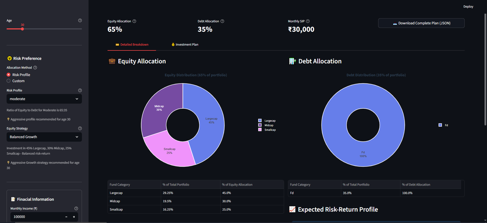
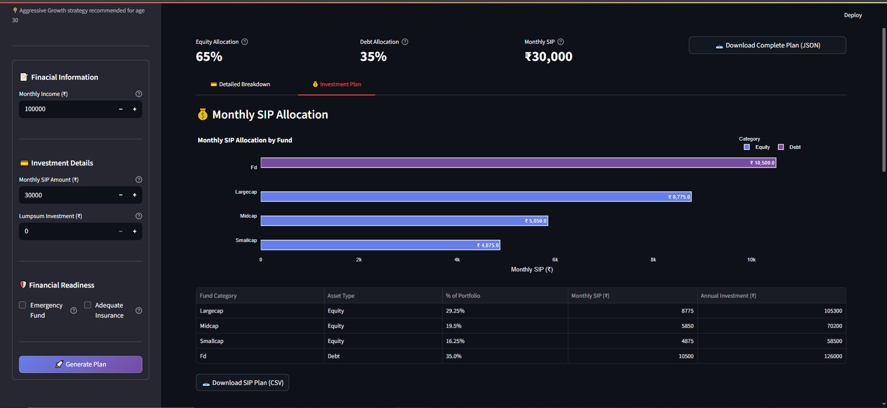
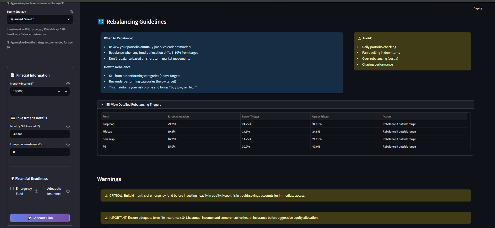

<div align="center">
    

#  Mutual Fund Asset Allocation Planner

  <p>
    An asset allocation tool for Indian mutual fund investors
  </p>
  
<!-- Badges -->
<p>
  <a href="https://www.python.org/">
    
  </a>
  <a href="https://streamlit.io/">
    
  </a>
  <a href="https://github.com/skylum1/MutualFunds-Allocation-Planner/blob/main/LICENSE">
    
  </a>
</p>

<h4>
    <a href="https://mutualfunds-allocation-planner-cefz5vha5aoatzcxxxufpt.streamlit.app/">View Demo</a> 
  <span> · </span>
    <a href="https://github.com/skylum1/MutualFunds-Allocation-Planner/issues">Report Bug</a>
  <span> · </span>
    <a href="https://github.com/skylum1/MutualFunds-Allocation-Planner/issues">Request Feature</a>
</h4>

</div>

# 📋 Table of Contents
- [About](#-about)
- [Screenshots](#-screenshots)
- [Features](#-features)
- [Tech Stack](#-tech-stack)
- [Getting Started](#-getting-started)
- [Usage](#-usage-guide)
- [Investment Strategies](#-investment-strategies)
- [Contributing](#-contributing)
- [Disclaimers](#️-disclaimers)
- [Useful Resources](#-resources)
- [License](#-license)

## 🎯 About
A Python-based investment planning tool inspired by **Monika Halan's Framework** for Indian mutual fund investors. It provides personalized asset allocation plans based on age, risk profile, and financial goals.

<details open>
<summary>

## 📷 Screenshots
</summary>
<div align="center"> 
  
  
  
  
</div>
</details >

## ✨ Features

### Core Features

<details open>
  <summary>Investment Planning</summary>
  <ul>
    <li>✨ Age-appropriate strategy selection</li>
    <li>📊 Risk-based allocation (Conservative/Moderate/Aggressive)</li>
    <li>📈 Multiple equity strategies</li>
    <li>💰 SIP & Lumpsum investment planning</li>
  </ul>
</details>

<details open>
  <summary>Portfolio Management</summary>
  <ul>
    <li>🔄 Portfolio rebalancing suggestions</li>
    <li>📱 Interactive visualizations</li>
    <li>📄 Downloadable reports (CSV/JSON)</li>
    <li>⚡ Real-time calculations</li>
  </ul>
</details>


## � Tech Stack

<details open>
  <summary>Core</summary>
  <ul>
    <li><a href="https://www.python.org/">Python 3.8+</a></li>
    <li><a href="https://streamlit.io/">Streamlit</a></li>
    <li><a href="https://plotly.com/">Plotly</a></li>
    <li><a href="https://pandas.pydata.org/">Pandas</a></li>
  </ul>
</details>


## 🚀 Getting Started

### Prerequisites
- Python 3.8 or higher
- pip package manager

### Installation

```bash
 pip install -r requirements.txt
 ```

### Step 2: Run the Application

```bash
streamlit run streamlit_app.py
```

The app will automatically open in your default web browser at `http://localhost:8501`

## 💻 Usage Guide

### Basic Workflow

1. **Fill Profile Information** (Left Sidebar)
   - Enter age, monthly income, investment amounts
   - Select allocation method for equity debt percentage split (Risk Profile/Custom)
   - Choose strategies for allocation within equity
   - Check emergency fund and insurance status


1. **Generate Plan**
   - Click "🚀 Generate Plan" button
   - View personalized allocation instantly

2. **Explore Recommendations**
   - Navigate through 2 tabs:
     - **Detailed Breakdown**: Complete fund allocations
     - **Investment Plan**: SIP/lumpsum amounts with rebalancing triggers

3. **Export Your Plan**
   - Download SIP plan as CSV
   - Download complete plan as JSON

### Advanced Usage

#### Using as Python Library

```python
from asset_allocation_engine import (
    AssetAllocationEngine, 
    UserProfile
)

# Create user profile
profile = UserProfile(
    age=30,
    monthly_income=100000,
    monthly_investment=30000,
    lump_sum_investment=500000,
    has_emergency_fund=True,
    has_adequate_insurance=True
)

# Generate plan
engine = AssetAllocationEngine()
plan = engine.create_plan(
    profile=profile,
    equity_strategy="balanced_growth",
    debt_strategy="long_term",
    add_international=True
)

# Access plan details
print(f"Equity: {plan.equity_percentage}%")
print(f"Debt: {plan.debt_percentage}%")
print(f"Total Funds: {plan.get_total_funds_count()}")

# Export to dict
plan_dict = plan.export_to_dict()
```

#### Rebalancing Your Portfolio
> [!CAUTION]
> Experimental require development and testing
```python
from asset_allocation_engine import PortfolioRebalancer

# Current portfolio values
current_values = {
    "largecap": 400000,
    "midcap": 150000,
    "smallcap": 180000,
    "fd": 270000
}

# Target allocations from your plan
target_allocations = {
    "largecap": 45.0,
    "midcap": 30.0,
    "smallcap": 25.0,
    "fd": 30.0
}

# Calculate current percentages
rebalancer = PortfolioRebalancer()
current_pct = rebalancer.calculate_current_allocation(current_values)

# Check if rebalancing needed
needs_rebalance, drifted_funds = rebalancer.check_rebalancing_needed(
    current_pct, target_allocations, drift_threshold=5.0
)

if needs_rebalance:
    # Calculate trades required
    trades = rebalancer.calculate_rebalance_trades(
        current_values, target_allocations
    )

    for fund, amount in trades.items():
        action = "BUY" if amount > 0 else "SELL"
        print(f"{action} {fund}: ₹{abs(amount):,.0f}")
```

## 📊 Investment Strategies

### 📈 Equity Strategies

| Strategy              | Large/Index | Mid-Cap | Small-Cap | Risk Level (Relative) | Best For                                        |
| --------------------- | ----------- | ------- | --------- | --------------------- | ----------------------------------------------- |
| **Index Core**        | 100%        | -       | -         | Low                   | Cost-conscious investors seeking market returns |
| **Market Weighted**   | 70%         | 20%     | 10%       | Low-Moderate          | Conservative equity investors, age 50+          |
| **Balanced Growth**   | 45%         | 30%     | 25%       | Moderate              | Mid-career (35-50), seeking balanced growth     |
| **Aggressive Growth** | 35%         | 35%     | 30%       | High                  | Young investors (20-35), high risk tolerance    |

### Debt Strategies

| Strategy         | Debt Component | Risk Level | Best For                                 |
| ---------------- | -------------- | ---------- | ---------------------------------------- |
| **Long Term FD** | 100% FD        | Very Low   | Safe, stable returns for long-term goals |
> [!NOTE]  
> Additional debt options based on user profile and goals are planned for future updates.


## 🤝 Contributing

Contributions welcome! Areas for improvement:

1. **Goal-Based Allocation**: Full implementation of goal-specific portfolios
2. **Comprehensive Recommendations**: More through recommendations based on user profile
3. **Rebalancing Suggestions**: Create rebalancing plan if portfolio allocation deviates beyond specified threshold. 

## 📞 Support & Feedback

For questions, suggestions, or issues:
- Create an issue on GitHub
- Review the code and documentation

## 📄 License

This project is open-source and available under the Apache License 2.0.

## 📚 Resources

### 📖 Recommended Reading
- **Let's Talk Mutual Funds** - Monika Halan (Primary reference for this tool)
- **The Little Book of Common Sense Investing** - John Bogle
- **One Up on Wall Street** - Peter Lynch
- **The Intelligent Investor** - Benjamin Graham

### 🌐 Useful Websites
<details>
  <summary>Research & Analysis</summary>
  <ul>
    <li><a href="https://www.valueresearchonline.com/">Value Research Online</a></li>
    <li><a href="https://www.morningstar.in/">Morningstar India</a></li>
    <li><a href="https://www.moneycontrol.com/">MoneyControl</a></li>
    <li><a href="https://www.amfiindia.com/">AMFI India</a></li>
  </ul>
</details>

<details>
  <summary>Investment Platforms</summary>
  <ul>
    <li><strong>Direct Plans:</strong> Coin (Zerodha), Kuvera, Groww</li>
    <li><strong>Advisory:</strong> Smallcase, Wright Research</li>
  </ul>
</details>


## ⚠️ Disclaimers

> [!WARNING]
> This tool is for educational purposes only. Always consult financial professionals for personalized advice.

<details>
  <summary>Important Notes</summary>
  
  1. **Not Financial Advice**
     - This tool provides educational guidance only
     - NOT a substitute for professional financial advice
  
  2. **Market Risk**
     - All investments subject to market risk
     - Past performance doesn't guarantee future returns
  
  3. **Professional Guidance**
     - Consult SEBI-registered investment advisor
     - Seek tax professional for tax planning
  
  4. **Regular Review**
     - Review allocation annually
     - Adjust based on life changes
</details>

---

**Remember**: The best investment strategy is one you can stick with through market ups and downs. Stay disciplined, stay diversified, and think long-term! 🚀💰

---

<div align="center">
Made with ❤️ and AI | © 2025 | Licensed under Apache 2.0
</div> 
